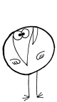
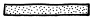
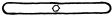
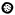
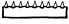
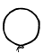
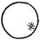
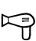
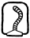
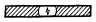

# Kill the Shadoks - Le jeu

## Le principe

Dans ce jeu inspiré de la série [The Incredible Machine](https://fr.wikipedia.org/wiki/The_Incredible_Machine), l'objectif est de construire une machine de [Rube Goldberg](https://fr.wikipedia.org/wiki/Machine_de_Rube_Goldberg) afin d'éliminer tous les shadoks de la scène.

## Historique

La version originale était le premier et le seul vrai jeu disponible sur killtheshadoks.com, site depuis longtemps disparu. C'était également ma première applet Java

## Création de niveau

La définition des niveaux est externalisée dans des fichiers json (`data/sceneXX.json`), index à partir de `00`. Ils sont chargés séquentiellement par le menu `KtsMenuScreen`. Le chargement s'arrête lorsqu'un niveau n'est pas disponible (Erreur 404 visible dans la console du navigateur)

La structure de niveau est définie dans le fichier `ktsObjects.ts`

```typescript
/** Structure de fichier json */
export interface Scene {
    color: string;
    description: string;
    objects: Array<ObjectDefinition>;
    spare: Array<SpareObjectDefinition>;
}

export interface ObjectDefinition {
    type: string;
    x: number;
    y: number;
    rotation?: number;
    fixed?: boolean;
    active?: boolean;
    dependencies?: Array<ObjectDefinition>;
}

export interface SpareObjectDefinition {
    type: string;
    rotation?: number;
}

```

## Les objets

Les objets sont décrits (et construits) dans la classe `ObjectFactory`

Objet | Type | Par défaut | Actif | Note
:---: | :---: | :---: | :---: | :---
<br>Shadok | shadok | masse=0 (fixe) | masse=2 | détruit par<br>les objets piquants<br>ou électriques
<br>Mur | wall | fixe | - |
<br>Balançoire | swing | fixe | mouvement selon<br>axe (central) |
<br>Plot | pin | fixe | - |
<br>Masse d'arme | mace | masse=10 | supprime shadok, ballon |
<br>Pics | pikes | fixe | supprime shadok, ballon |
<br>Ballon de baudruche | balloon | masse=-1 | - | détruit par<br>les objets piquants
<br>Ballon | ball | masse=1 | - |
<br>Sèche cheveux | dryer | fixe | projette les<br>objets mobiles |
<br>Aspirateur | vacuum | fixe | attire les<br>objets mobiles |
<br>Trappe | trap | fixe | mouvement selon<br>axe |
<br>Tapis roulant (gauche) | lrunner | fixe | déplacement des objets<br>vers la gauche |
<br>Tapis roulant (droite) | rrunner | fixe | déplacement des objets<br>vers la droite |
<br>Trampoline | trampo | fixe | fait rebondir<br>les objets |
<br>Plaque électrifiée | elec | fixe | supprime shadok |
<br> | button | fixe | Change l'état des<br>objets associés | Les objets sont définis<br>dans l'attribut<br>`dependencies`


## Licence

Le jeu est construit sur le moteur physique [p2.js](https://github.com/schteppe/p2.js) de [Stefan Hedman](http://steffe.se/) (Licence MIT) et le moteur de rendu [zepr.ts](https://github.com/zepr/zepr.ts) (Licence LGPL)

Le jeu en lui-même est distribué sous licence GPLv3

## Changelog

### 0.8.1 - 2019.04.20

- Passage à zepr.ts@0.3.0
- Ajout du mode "plein écran"

### 0.8.0 - 2019.04.01

- Passage à un repository public

